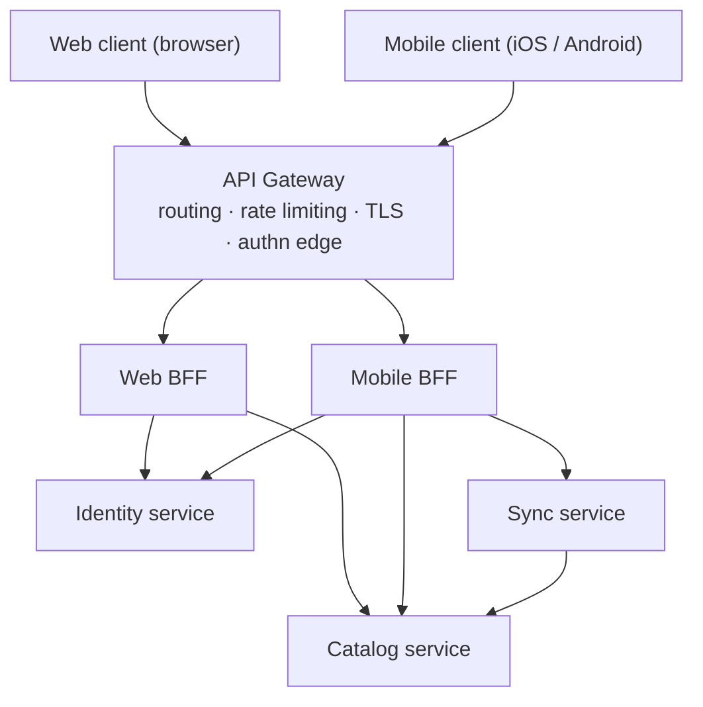

# Multi-Client Platform Architecture

A reference architecture for web and mobile applications built with
an API Gateway and Backend for Frontend (BFF) pattern.

The project demonstrates client-specific API composition, authentication,
domain-service integration, offline-first synchronization, and API contracts
for browser and mobile clients.

## Overview

Modern products ship to several clients at once — a browser **web application** and
one or more native **mobile applications** — each with different performance budgets,
payload shapes, and connectivity assumptions. This repository is a **system-design
reference** for serving all of them from a single backend platform.

- **API Gateway** — a single entry point for routing, TLS termination, rate limiting,
  and edge authentication.
- **Backend for Frontend (BFF)** — a dedicated backend per client type that composes
  and shapes responses for that client's exact needs (web BFF, mobile BFF).
- **Domain services** — client-agnostic services, each owning a bounded context
  (identity, catalog, sync).
- **Authentication & authorization** — token-based auth (JWT / OAuth 2.0 / OIDC)
  flowing from client → gateway → BFF → services.
- **Offline-first synchronization** — local-first data, change queues, and conflict
  resolution between mobile clients and the platform.
- **API contracts** — OpenAPI for synchronous request/response schemas and an event
  catalog for asynchronous, event-driven communication.

## High-level architecture

## Status

Architecture reference / template. It describes the intended structure and patterns;
component implementations are intentionally left out.

## Keywords

Reference architecture · system design · software architecture · API Gateway ·
Backend for Frontend · BFF · domain services · microservices · web architecture ·
mobile architecture · offline-first · offline sync · authentication · OAuth 2.0 ·
OpenID Connect · JWT · API contracts · OpenAPI · event-driven · TypeScript.
